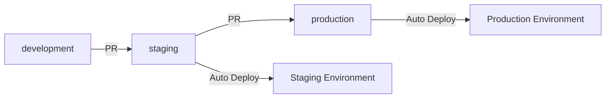

# MicroBima

[](https://opensource.org/licenses/MIT)
[](https://www.typescriptlang.org/)
[](https://nestjs.com/)
[](https://nextjs.org/)

**Modern API-first micro-insurance core designed for flexible products, fast onboarding, and robust partner integrations.**

## 🎯 What is MicroBima?

MicroBima is a comprehensive micro-insurance platform that digitizes insurance operations for individuals and groups in Africa. It provides role-specific portals for customers, brokers, agents, providers, and partners, with flexible premium schedules and robust API integrations.

### Key Features

- 🏥 **Multi-role Portals**: Customer, broker, provider, and admin dashboards
- 💳 **Flexible Payments**: Daily, weekly, monthly, and custom premium schedules
- 🔌 **Partner APIs**: Secure public APIs for insurtech integrations
- 📊 **Analytics**: Comprehensive reporting and business intelligence
- 🔒 **Security**: Enterprise-grade authentication and authorization
- 🚀 **Scalable**: Cloud-native architecture with auto-scaling

## 🏗️ Architecture

```
┌─────────────────┐    ┌─────────────────┐    ┌─────────────────┐
│   Customer      │    │   Broker        │    │   Provider      │
│   Portal        │    │   Portal        │    │   Portal        │
│   (Mobile)      │    │   (Web)         │    │   (Web)         │
└─────────────────┘    └─────────────────┘    └─────────────────┘
         │                       │                       │
         └───────────────────────┼───────────────────────┘
                                 │
                    ┌─────────────────┐
                    │   Kong Gateway  │
                    │   (Public API)  │
                    └─────────────────┘
                                 │
                    ┌─────────────────┐
                    │   Internal API  │
                    │   (NestJS)      │
                    └─────────────────┘
                                 │
                    ┌─────────────────┐
                    │   PostgreSQL    │
                    │   Database      │
                    └─────────────────┘
```

## 🚀 Quick Start

### Prerequisites

- Node.js 18+ and pnpm
- PostgreSQL database
- Fly.io account (for deployment)

### Development Setup

1. **Clone the repository**
   ```bash
   git clone https://github.com/your-org/microbima.git
   cd microbima
   ```

2. **Install dependencies**
   ```bash
   pnpm install
   ```

3. **Set up environment variables**
   ```bash
   cp env.example .env
   # Edit .env with your configuration
   ```

4. **Start development servers**
   ```bash
   pnpm dev
   ```

## 📚 Documentation

### Core Documentation
- **[Master Document](dev_docs/microbima_master_document.md)** - Complete product and technical blueprint
- **[Architecture Decisions](docs/architecture/decisions/)** - Key architectural choices and rationale
- **[Development Guide](docs/quick-reference/development-guide.md)** - Developer quick reference

### Deployment & Operations
- **[Fly.io Deployment Guide](docs/deployment/fly-deployment-guide.md)** - Comprehensive deployment guide
- **[Manual Deployment Commands](docs/deployment/manual-deployment-commands.md)** - Emergency deployment procedures
- **[Environment Strategy](docs/deployment/environment-strategy.md)** - Multi-environment management

### API & Integration
- **[API Testing Guide](docs/API_Testing_Guide.md)** - API testing procedures
- **[Postman Collection](docs/MicroBima_API_Collection.postman_collection.json)** - API test collection

## 🏛️ Project Structure

```
microbima/
├── apps/
│   ├── api/                    # NestJS Backend API
│   ├── web-admin/              # Next.js Admin Dashboard
│   └── mobile/                 # React Native Mobile App
├── packages/
│   ├── common-config/          # Shared configuration
│   ├── sdk/                    # Generated TypeScript SDK
│   └── ui/                     # Shared UI components
├── infra/
│   └── fly/                    # Fly.io deployment configs
├── docs/                       # Documentation
└── dev_docs/                   # Development documentation
```

## 🔧 Technology Stack

- **Backend**: NestJS, Prisma, PostgreSQL
- **Frontend**: Next.js, React Native
- **API Gateway**: Kong
- **Authentication**: Authentik (OIDC/OAuth2)
- **Deployment**: Fly.io
- **Monitoring**: Sentry, PostHog
- **Database**: PostgreSQL

## 🌍 Environments

| Environment | Purpose | URL |
|-------------|---------|-----|
| **Development** | Local development | `http://localhost:3000` |
| **Staging** | Testing & integration | `https://microbima-staging-*.fly.dev` |
| **Production** | Live production | `https://microbima-production-*.fly.dev` |

## 🤝 Contributing

1. **Read the [Development Guide](docs/quick-reference/development-guide.md)**
2. **Follow [Coding Standards](docs/development/coding-standards.md)**
3. **Check [Architecture Decisions](docs/architecture/decisions/)**
4. **Create feature branch from `development`**
5. **Submit pull request to `staging`**

## 📋 Development Workflow



## 🔒 Security

- **Authentication**: OIDC/OAuth2 with Authentik
- **Authorization**: Role-based access control
- **API Security**: Kong gateway with rate limiting
- **Data Protection**: Encrypted at rest and in transit
- **Audit Logging**: Comprehensive activity tracking

## 📊 Monitoring & Analytics

- **Error Tracking**: Sentry for error monitoring
- **Performance**: OpenTelemetry tracing
- **Analytics**: PostHog for user analytics
- **Business Intelligence**: Metabase dashboards

## 🚀 Deployment

### Automated Deployment
- **Staging**: Auto-deploy on push to `staging` branch
- **Production**: Auto-deploy on push to `production` branch

### Manual Deployment (Emergency)
```bash
# Staging
flyctl deploy -a microbima-staging-internal-api -c infra/fly/internal-api/staging/fly.toml

# Production
flyctl deploy -a microbima-production-internal-api -c infra/fly/internal-api/production/fly.toml
```

## 📄 License

This project is licensed under the MIT License - see the [LICENSE](LICENSE) file for details.

## 🤝 Support

- **Documentation**: Check the [docs](docs/) directory
- **Issues**: Create a GitHub issue
- **Discussions**: Use GitHub Discussions for questions

---

**Built with ❤️ for the African micro-insurance market**