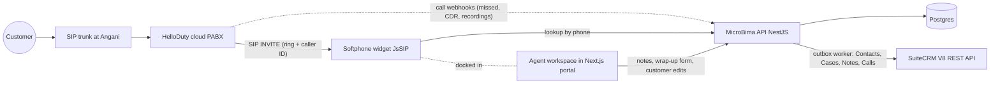

# SuiteCRM + HelloDuty Call Center Integration Plan

> **Status:** Approved direction (brainstorm concluded 2026-08-14). Supersedes
> [`vtiger-integration-plan.md`](./vtiger-integration-plan.md), which is retained for
> historical reference only.

## 1. Vision

Customers call in on a SIP line. Customer care agents have a SIP client where they can
accept, reject, or place calls. As a call rings, the agent sees minimal data about the
caller (screen-pop); on answering, the full customer view opens. While serving the
customer, the agent captures notes, which are saved as tickets/notes in the CRM. The
agent workspace occupies most of the screen with the SIP client docked in a small
portion of it.

## 2. Decisions log

| # | Decision | Choice | Rationale |
|---|----------|--------|-----------|
| 1 | CRM | **SuiteCRM** (self-hosted at `maishapoa.co.ke/crm`) | Replaces the earlier VTiger plan. Also serves the sales team, so no native ticketing is built in MicroBima. |
| 2 | Ticketing | **SuiteCRM Cases** (no native MicroBima ticketing) | CRM is shared with sales; one ticket/interaction store. |
| 3 | Telephony | **HelloDuty cloud PABX**; SIP trunk terminates at angani.co | No self-managed PBX (no Asterisk). Queues, IVR, routing, recording are HelloDuty's responsibility. |
| 4 | Agent workspace | **Web-based, inside the existing Next.js portal** (`apps/agent-registration`) | Insurance data (policies, payments, dependants, SMS history) lives in the core system; auth (`customer_care` role), role-gated routes, Socket.IO client, and admin UI components already exist there. No Windows/Electron app. |
| 5 | Sync direction | **One-way: core → SuiteCRM** | Core system is master for all customer identity data. No CRM-initiated edits flow back. Synced fields are locked (read-only) for staff in SuiteCRM via role permissions/convention; the sync worker overwrites them anyway. |
| 6 | Sync transport | **Outbox table + cron worker** (same pattern as `MessagingWorker`) | At ~5 agents, RabbitMQ (from the VTiger plan) is overkill. Zero new infrastructure. |
| 7 | Agent identity | **`suitecrmUserId` stored on `BrandAmbassador`**, matched by email once at link time | See section 7. |
| 8 | Passwords | **Independent credentials** in Supabase and SuiteCRM (no password sync) | Password mirroring (VTiger plan) means the API handles plaintext passwords. SSO (SAML/LDAP) is the future path if two logins become annoying. |
| 9 | Scale target | **~5 concurrent call agents** | No supervisor dashboards, wallboards, or presence management in our workspace; HelloDuty's own portal covers monitoring. |

## 3. Architecture

Division of labor:

- **Call agents** work in the MicroBima portal (customer 360 + softphone + note capture).
- **SuiteCRM** is the back-office ticketing/sales database. Supervisors, sales, and
  ticket follow-up work happen in SuiteCRM's own UI, which sees everything agents log.
- **HelloDuty** owns queues, IVR, routing, trunk capacity, and call recording.

## 4. Call notification model (how the screen-pop works)

Two independent layers:

### Layer 1 — ringing the SIP client (free, no integration work)

The agent's SIP client registers as an extension on HelloDuty's PBX. Incoming calls
arrive as SIP INVITEs carrying the caller ID; the client rings on its own.

### Layer 2 — the screen-pop (two variants; choice depends on HelloDuty's answers)

- **Variant A (preferred) — browser softphone as CTI source.** A JsSIP/SIP.js widget in
  the workspace registers over secure WebSocket (WSS). On the incoming-call event the
  widget reads the caller ID from the INVITE, calls the internal lookup endpoint, and
  pops the minimal customer card; on answer it expands to the full 360 view. No PBX
  webhook needed for the pop.
- **Variant B (fallback) — webhook-driven pop.** Agents use a desktop softphone
  (MicroSIP/Zoiper) for audio. HelloDuty call-event webhooks (ringing/answered/hangup)
  land on a new controller under `apps/api/src/controllers/webhooks/`; the API maps the
  target extension to a logged-in agent and pushes the pop over a Socket.IO gateway
  (same pattern as `apps/api/src/gateways/payment-status.gateway.ts`).

In both variants, HelloDuty webhooks / CDR API are still wanted as a supplement for
things the client cannot see: missed/abandoned calls, calls answered by another agent,
server-side call logging, and recording URLs.

### Questions pending with HelloDuty

1. Can a third-party WebRTC / SIP-over-WebSocket client (JsSIP) register as an
   extension? What is the WSS endpoint and per-extension credential model?
2. Do you offer call-event webhooks (ringing / answered / hangup / missed) per queue or
   extension, with caller number and agent extension in the payload? (Is this the
   SautiKit API?)
3. Is there a CDR / call-log REST API, and can recording URLs be retrieved from it?
4. Your CTI list covers Salesforce/Zendesk/Zoho/Odoo/Freshdesk — is there a "custom
   CRM" webhook option? (We would still route events through our API rather than
   PBX → CRM directly, so the core stays the source of truth for the customer match.)
5. Is there a click-to-call REST API (needed for Variant B outbound)?

## 5. Inbound call flow

1. Call hits HelloDuty queue → routed to an agent extension → softphone rings.
2. Screen-pop (Variant A or B): caller number → `GET /api/internal/customers/lookup-by-phone`
   → **minimal card**: name, status, active policy count. Unknown numbers pop an
   "unregistered caller" card with a quick-create/search affordance.
3. Agent accepts → **full 360 view**: profile, policies with status, premium/payment
   history, dependants and beneficiaries, SMS history (`MessagingDelivery`), open
   missing requirements. A draft interaction record starts.
4. During/after the call, agent fills the **wrap-up form**: category (inquiry,
   complaint, payment issue, ...) + free-text notes.
5. Save → SuiteCRM **Case** (the ticket) + **Note** attached to the customer's Contact,
   via the outbox if SuiteCRM is unreachable (an agent never loses notes to a CRM
   outage). On hangup, call metadata (direction, duration, outcome, recording URL when
   available) is logged as a SuiteCRM **Call** activity linked to Contact and Case.

## 6. Outbound call flow (e.g. completing missing registration data)

Outbound is the simpler flow: the agent starts from the customer record, so the
interaction is born linked to the right customer and Contact — no phone lookup needed.

1. A **"Follow-ups" work-queue tab** in the workspace lists customers with open
   `MissingRequirement` records (and callbacks from missed calls), showing what is
   missing per customer.
2. Agent opens a row → customer 360 with missing fields highlighted as an **inline edit
   form** → clicks the phone number to dial (**click-to-dial**).
   - Variant A: the JsSIP widget sends the INVITE through the PBX out the trunk.
   - Variant B: the workspace calls HelloDuty's click-to-call API ("connect extension
     102 to +2547..."); the PBX rings the agent first, then bridges the customer.
3. During the call, the agent fills the missing fields inline. Saves go through the
   existing internal customer-update endpoints (normal validation applies), resolving
   `MissingRequirement` records in real time.
4. On hangup, the same wrap-up form applies; notes → Case/Note, call → outbound Call
   activity.

## 7. Agent identity mapping (core ↔ SuiteCRM)

Customer care agents are Supabase users managed via the manage-agents module, with a
`BrandAmbassador` row keyed by `userId` and the `customer_care` role in
`user_metadata.roles`.

- **Schema:** add `suitecrmUserId` (String?, nullable) — and optionally
  `suitecrmLinkedAt` — to `BrandAmbassador`.
- **Provisioning:** the ~5 agents are created **manually** in SuiteCRM admin, using the
  **same email address** as their Supabase login. They set their own SuiteCRM password
  (no password sync).
- **Linking:** a "Link to CRM" action in Manage Agents (or an automatic pass in the
  sync worker) queries SuiteCRM's Users module by email and stores the returned user ID
  in `suitecrmUserId`. The admin UI shows a linked/not-linked badge.
- **Why store the ID (not email at runtime):** all API writes to SuiteCRM go through a
  single integration OAuth2 client, so records would otherwise be owned by "MicroBima
  Integration". Attribution is achieved by setting `assigned_user_id` on Cases, Notes,
  and Calls — that field takes a SuiteCRM user ID. Storing the ID avoids an
  email-lookup round-trip per write, survives email changes, and makes link state
  visible per agent.

## 8. Contact sync: field mapping

**Principle:** sync identity + classification (rarely changing, helps CRM users
recognize/segment contacts); link — don't sync — volatile transactional data.

### Synced to SuiteCRM Contacts (standard fields)

| Core field | SuiteCRM Contact field |
|------------|------------------------|
| `firstName` / `middleName` / `lastName` | `first_name` / `last_name` (middle folded per convention) |
| `phoneNumber` (normalized) | `phone_mobile` |
| `email` | `email1` |
| `dateOfBirth` | `birthdate` |

### Synced (custom fields, created once in SuiteCRM Studio)

| Custom field | Source | Purpose |
|--------------|--------|---------|
| MicroBima Customer ID | `Customer.id` (UUID) | Join key; traceability |
| ID Type + ID Number | `idType` / `idNumber` | Primary human disambiguator (compound-unique in core) |
| Scheme / Package | `PackageSchemeCustomer` / policy package | Sales segmentation |
| Customer Status | `Customer.status` | Filtering |
| Registration Source | partner / brand ambassador | Filtering |
| Portal Link | deep link to portal customer page | One click from CRM to full picture |

### Explicitly NOT synced as fields

Policy statuses, premium balances, payment history, missing-requirements detail — these
change constantly and would leave the CRM perpetually slightly wrong. The Portal Link
covers those needs. (A low-frequency summary field such as "last payment date" can be
added later if sales campaign targeting demands it.)

### One-way sync enforcement

- Direction is **core → SuiteCRM only** for all synced fields.
- In SuiteCRM, synced fields are locked (read-only) for staff via role permissions /
  convention; the sync worker overwrites them on every update regardless, so CRM-side
  edits to synced fields do not stick, by design.
- CRM-owned data (Cases, sales pipeline, Leads, Notes) never syncs back to core; agents
  read tickets in SuiteCRM when doing follow-up work.
- If a genuine need for CRM-initiated updates emerges later, the path is a SuiteCRM
  logic hook calling a webhook on our API (going through core validation) — explicitly
  out of scope for the initial build.

## 9. SuiteCRM API notes

- V8 REST API, OAuth2 **client-credentials** grant for the integration client.
- Auth endpoint is `/legacy/Api/access_token` (not `/Api/access_token`); module
  endpoints under `/Api/V8/module/...`. **Paths are case-sensitive.** Exact prefix can
  vary by install (`/legacy/`, `/public/legacy/`) — verify against the instance.
- `Content-Type` and `Accept` must be `application/vnd.api+json` (JSON:API format).
- Tokens last ~1 hour → client must cache and refresh.
- Relevant modules: `Contacts`, `Cases`, `Notes`, `Calls`, `Users` (email → ID lookup
  for agent linking).

## 10. Build order

Each step is independently shippable; external dependencies (SuiteCRM instance,
HelloDuty answers) are pushed as late as possible.

### Step 1 — Phone lookup foundation (no external dependencies)

- Add a **plain (non-unique) index** on `Customer.phoneNumber` via Prisma migration
  (one phone can legitimately serve multiple customers, e.g. a household).
- **Phone normalization** helper (canonical format, e.g. E.164) applied at write time
  and lookup time; `+254712345678` vs `0712345678` vs `254712345678` must all match.
- New internal endpoint `GET /api/internal/customers/lookup-by-phone` in
  `apps/api/src/controllers/internal/customer.controller.ts`, behind Supabase JWT +
  `customer_care`/admin roles. Returns two tiers: minimal (on-ring) and full 360
  (on-answer).

### Step 2 — SuiteCRM client + customer → Contact sync

- `apps/api/src/modules/crm/` (or `services/suitecrm/`): API client with OAuth2 token
  caching, typed methods for Contacts/Cases/Notes/Calls/Users. Config (URL, client ID,
  secret, `SUITECRM_ENABLED` flag) via the existing configuration service.
- Schema: `suitecrmContactId` (String?, unique), `crmSyncStatus`, `crmLastSyncedAt`,
  `crmSyncError` on `Customer`; `suitecrmUserId` on `BrandAmbassador`.
- Outbox table (e.g. `CrmSyncJob`) + `@nestjs/schedule` cron worker with retry/backoff
  (mirror the `MessagingWorker` pattern). Hooks in `customer.service.ts` enqueue on
  create/update.
- One-off backfill script for the existing customer base; sync status surfaced in admin.

### Step 3 — Agent workspace in the portal

- New role-gated route, e.g. `apps/agent-registration/src/app/(main)/care/workspace/`.
- Search (phone/name/ID) + customer 360 (largely composition of existing internal
  endpoints used by admin customer pages).
- Wrap-up form → Case + Note via Step 2 client (sync path with outbox fallback).
- Follow-ups work-queue tab driven by `MissingRequirement`, with inline edit of missing
  fields.
- Dev-only "simulate incoming call" affordance to build/demo the screen-pop flow before
  telephony is wired.

### Step 4 — Telephony wiring (blocked on HelloDuty answers)

- **Variant A:** JsSIP softphone widget docked in the workspace — register extension on
  login; ring/accept/reject/dial/mute/hold; caller-ID-driven pop; click-to-dial.
- **Variant B:** webhook controller + Socket.IO gateway for pops; desktop softphone for
  audio; HelloDuty click-to-call API for outbound.
- Both: on hangup, log Call activity (direction, duration, outcome, recording URL) to
  SuiteCRM, linked to Contact and Case; missed/abandoned calls create follow-up entries.

## 11. Out of scope (deliberately)

- Native ticketing in MicroBima.
- Bidirectional contact sync / CRM-initiated customer edits.
- Password sync between Supabase and SuiteCRM (SSO via SAML/LDAP is the future option).
- Automated SuiteCRM user provisioning (5 agents → manual creation + link action).
- RabbitMQ or any new queue infrastructure (outbox + cron worker instead).
- Supervisor dashboards / wallboards / presence in our workspace (HelloDuty portal
  covers monitoring).
- Windows/Electron desktop app (web workspace; desktop softphone only as Variant B
  audio fallback).

## 12. Open items

1. HelloDuty questionnaire (section 4) — determines Variant A vs B for Step 4.
2. SuiteCRM instance readiness: OAuth2 client created, Studio custom fields added,
   agent accounts created with Supabase-matching emails, synced-field permissions
   locked for staff roles.
3. Decide canonical phone storage format and audit existing data before the Step 1
   migration.
4. Confirm middle-name folding convention for Contact sync.
