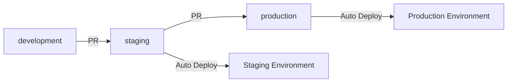

# Environment Strategy & CI/CD Deployment

## 🎯 Overview

This document outlines the strategy for managing multiple environments (staging, production) and implementing CI/CD pipelines for automated deployments.

## 🏗️ Architecture Decision

### **Chosen Approach: Environment-Specific Directories**

```
infra/fly/
├── internal-api/
│   ├── staging/
│   │   └── fly.toml
│   └── production/
│       ├── fly.toml
│       └── Dockerfile (production-optimized)
├── web-admin/
│   ├── staging/
│   │   ├── fly.toml
│   │   └── Dockerfile
│   └── production/
│       ├── fly.toml
│       └── Dockerfile (production-optimized)
└── public-api/
    ├── staging/
    │   ├── fly.toml
    │   └── Dockerfile
    └── production/
        ├── fly.toml
        └── Dockerfile (production-optimized)
```

### **Rationale:**
- ✅ **Clear separation** of environment-specific configurations
- ✅ **Production-specific optimizations** (security, monitoring, performance)
- ✅ **Easy maintenance** - each environment is self-contained
- ✅ **CI/CD friendly** - clear paths for automated deployments
- ✅ **Scalable** - easy to add new environments (dev, pre-prod, etc.)

## 🚀 Deployment Strategy

### **Branch-Based Deployment**

| Branch | Environment | Apps | Trigger |
|--------|-------------|------|---------|
| `development` | Local/Dev | All | Manual |
| `staging` | Staging | All | Auto (on push) |
| `production` | Production | All | Auto (on push) |

### **Deployment Flow**



## 🔧 Environment-Specific Configurations

### **Staging Environment**
- **Purpose**: Testing, integration, pre-production validation
- **Characteristics**:
  - More verbose logging (`LOG_LEVEL=debug`)
  - Higher Sentry sampling (`SENTRY_TRACES_SAMPLE_RATE=0.1`)
  - Lower resource limits (1 CPU, 512MB RAM)
  - Less restrictive security settings

### **Production Environment**
- **Purpose**: Live production traffic
- **Characteristics**:
  - Optimized logging (`LOG_LEVEL=info`)
  - Lower Sentry sampling (`SENTRY_TRACES_SAMPLE_RATE=0.01`)
  - Higher resource limits (2 CPU, 1024MB RAM)
  - Enhanced security (dumb-init, non-root user)
  - Production-specific monitoring

## 🛠️ CI/CD Pipeline

### **GitHub Actions Workflow**

The pipeline automatically:
1. **Triggers** on pushes to `staging` or `production` branches
2. **Runs tests** before deployment
3. **Deploys** all apps to the appropriate environment
4. **Performs health checks** after deployment

### **Manual Deployment Commands**

```bash
# Deploy to staging
flyctl deploy -a microbima-staging-internal-api -c infra/fly/internal-api/staging/fly.toml

# Deploy to production
flyctl deploy -a microbima-production-internal-api -c infra/fly/internal-api/production/fly.toml
```

## 🔒 Security Considerations

### **Production Enhancements**
- **dumb-init**: Proper signal handling for graceful shutdowns
- **Non-root user**: Security isolation
- **Minimal base image**: Reduced attack surface
- **Security scanning**: Automated vulnerability checks in CI/CD

### **Environment Isolation**
- **Separate Fly.io apps** for each environment
- **Different resource limits** and scaling policies
- **Environment-specific secrets** and configuration

## 📊 Monitoring & Observability

### **Staging**
- **Debug logging** enabled
- **Higher sampling rates** for testing
- **Development-friendly** error messages

### **Production**
- **Optimized logging** for performance
- **Lower sampling rates** to reduce costs
- **Production-ready** error handling

## 🚦 Deployment Process

### **1. Development to Staging**
```bash
# 1. Create feature branch
git checkout -b feature/new-feature

# 2. Make changes and commit
git add .
git commit -m "Add new feature"

# 3. Push to development
git push origin development

# 4. Create PR to staging
# 5. Merge PR triggers automatic deployment to staging
```

### **2. Staging to Production**
```bash
# 1. After testing in staging, create PR to production
# 2. Merge PR triggers automatic deployment to production
# 3. Monitor deployment logs and health checks
```

## 🔄 Maintenance Strategy

### **Configuration Updates**
- **Environment-specific changes**: Update the respective `fly.toml` files
- **Shared changes**: Update the base Dockerfiles
- **Production changes**: Update production-specific Dockerfiles

### **Adding New Environments**
1. Create new directory: `infra/fly/app-name/environment/`
2. Copy and modify existing `fly.toml`
3. Create environment-specific Dockerfile if needed
4. Update CI/CD pipeline
5. Update this documentation

## 📋 Checklist for New Deployments

### **Before First Deployment**
- [ ] Create environment-specific directories
- [ ] Configure `fly.toml` files with correct app names
- [ ] Set up environment-specific secrets in Fly.io
- [ ] Test deployment manually
- [ ] Configure CI/CD pipeline
- [ ] Set up monitoring and alerting

### **Before Production Deployment**
- [ ] Test thoroughly in staging
- [ ] Verify all environment variables are set
- [ ] Check security configurations
- [ ] Ensure monitoring is in place
- [ ] Have rollback plan ready

## 🎯 Benefits of This Approach

1. **Clear Separation**: Each environment has its own configuration
2. **Production Optimization**: Specialized Dockerfiles for production
3. **Automated Deployments**: CI/CD handles the deployment process
4. **Easy Maintenance**: Changes are isolated to specific environments
5. **Scalable**: Easy to add new environments or apps
6. **Secure**: Production-specific security enhancements
7. **Observable**: Environment-specific monitoring and logging

## 🚨 Troubleshooting

### **Common Issues**
- **Wrong environment**: Check which `fly.toml` file is being used
- **Missing secrets**: Verify environment variables in Fly.io dashboard
- **Deployment failures**: Check CI/CD logs and Fly.io logs
- **Health check failures**: Verify app is listening on correct port

### **Rollback Strategy**
```bash
# Rollback to previous deployment
flyctl releases -a app-name
flyctl deploy -a app-name --image-label previous-version
```

---

**Last Updated**: September 9, 2025
**Status**: ✅ Ready for Implementation
